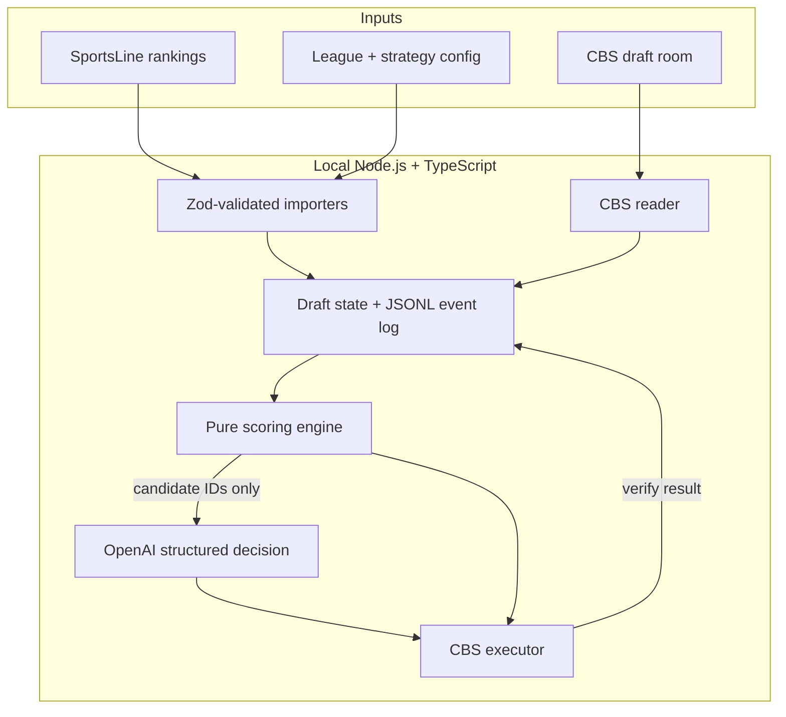

# Fantasy Draft Agent

A local-first TypeScript agent for live fantasy football drafts. It reads a CBS draft room, scores remaining players with a deterministic engine, and optionally asks an LLM to choose **only among that shortlist**.

Built for a real **16-team PPR keeper league** — unusual draft capital, two keepers, snake-draft timing pressure — where a wrong click is worse than no click.

The interesting part is not that an LLM can pick a player. It is that the LLM is not allowed to invent one, click one, or recover from a failed check by guessing.

```text
SportsLine XLSX ─┐
League config ───┼─► deterministic engine ─► shortlist (5–10 IDs)
CBS draft room ──┘            │
                              ▼
                    bounded LLM ranker
                    (structured output, shortlist-only)
                              │
                              ▼
              recommend / confirm / (gated) execute
                              │
                              ▼
                   verify CBS recorded the pick
```

## Why this exists

A static ranking sheet goes stale after the first few picks. A pure “AI browser agent” can misread the page, hallucinate an unavailable player, or click the wrong row with the clock running.

This project treats that as a **reliability problem**, not a prompt-engineering problem:

- Playwright extracts structured draft state.
- A pure scoring engine produces an ordered, explainable shortlist.
- OpenAI may reorder that shortlist. It cannot add a name.
- A separate executor is the only component allowed to click — and only after safety gates pass.
- If any invariant fails, the agent **stops**. The human drafts.

Default live mode is `recommend`, not autopilot.

## Design that a production system would actually need

| Constraint | What the code does |
| --- | --- |
| LLMs hallucinate | Model output is Zod-validated. Selected IDs must be in the shortlist. Anything else is discarded and the deterministic #1 is used. |
| Pages are untrusted | The model receives normalized JSON (player, position, scores, roster). Not HTML, chat, ads, or cookies. |
| Clicks are irreversible | Reader and executor are separate modules. Live CBS execution is feature-flagged and fail-closed. |
| Auth is sensitive | No CBS credentials in source, config, or env. The operator logs in manually in a visible persistent browser. |
| State can lie | Local draft state is reconciled against CBS results. Identity conflicts are surfaced, not silently overwritten. |
| Timeouts happen | AI timeout, API error, low confidence, or malformed output → deterministic fallback. Never “guess to keep going.” |
| You only get one submit | Idempotent pick IDs. Duplicate submit is rejected. A wrong-player verification disables the executor. |

Scoring weights live in config, not magic numbers. Every recommendation logs component scores so a pick is explainable: SportsLine rating, ADP value, roster need, scarcity, next-pick risk, tier cliff, and penalties.

## Architecture



The engine is fully unit-testable with no browser and no network. Browser automation is an adapter around that core, not the core itself.

### Execution modes

| Mode | Behavior |
| --- | --- |
| `monitor` | Read and log the live room. No recommendation, no click. |
| `recommend` | Rank + explain. Default. |
| `confirm` | Prepare the pick; a human must confirm. |
| `autopilot` | Submit only if every safety gate passes. Disabled by default. |

## What is implemented

**Decision core**

- SportsLine XLSX importer (six position sheets, name normalization, collision reporting)
- Zod-validated league and strategy config
- Deterministic scoring, eligibility, and shortlist generation
- Explainable component notes on every candidate
- Fixture replay for a 16-team mock draft

**Bounded AI layer**

- OpenAI Responses API + Zod structured outputs
- Shortlist-membership enforcement
- Timeout / error / low-confidence fallback to the engine

**CBS integration**

- Playwright persistent context; manual login
- Domain allowlist
- Read-only live-room adapter and diagnostics
- Live `recommend` loop and public CBS mock join helper (no Join/Draft clicks)
- Local fake draft room for executor tests (verified picks, duplicate-submit rejection, wrong-player lockout)
- Live pick clicking remains gated until mock-draft validation — on purpose

**Observability**

- Append-only JSONL event log
- Secret-like keys stripped before write

## Tech stack

TypeScript (strict) · Node.js 20+ · Playwright · OpenAI SDK · Zod · Vitest · xlsx

## Quick start

```bash
npm install
npm test
npm run typecheck
```

Rank a frozen draft snapshot (no browser, no API key):

```bash
npm run rank:fixture -- fixtures/pick-21.json
```

Demo the engine against the current league config and SportsLine sheet:

```bash
npm run rank:demo
```

Optional AI ranking on a fixture (needs `OPENAI_API_KEY` in a local `.env`; copy `.env.example`):

```bash
npm run decide:fixture -- fixtures/pick-21.json
```

Read-only CBS monitor — opens a visible browser; you log in yourself:

```bash
npm run cbs:monitor
```

Join a public CBS mock and print live recommendations (no clicks; you still pick in the browser):

```bash
npm run cbs:mock
```

That opens `https://mockdraft.football.cbssports.com/`. Log in if needed, join a **12-team PPR Standard** mock yourself, then press Enter in the terminal when the draft room is open. When you are on the clock, the engine shortlist and (if `OPENAI_API_KEY` is set) the model choice print. Use `--no-ai` to skip the model. Do not open the All in the Family room with this command.

Confirm-mode mock practice (public mock only; All in the Family stays recommend-only):

```bash
npm run cbs:mock-confirm
```

You still click Join. The command waits for the mock room, overlays team count and PPR vs Standard from visible text, recommends when you are up, and only after you press Enter it clicks Draft once and verifies the result. Search/draft locators must be captured from that room while YOU ARE UP (`npm run cbs:diagnose-mock`) and saved to `config/selectors.local.json`. Do not guess those locators. The SportsLine sheet remains CBS PPR 12-team even if the mock is 10-team or non-PPR.

Mock diagnose uses a separate Chrome profile (`.local/cbs-mock-browser-profile`) so companion can keep the live room open. It opens the last mock room URL from `.local/mock-start-url.txt` when that file exists. Join or wait in the Chrome window this command opens, not in your own browser. The command waits until **YOU ARE UP** before dumping search/Draft locators.

League-room recommend mode (still no clicks):

```bash
npm run cbs:recommend
```

Do not put a CBS password in `.env`. The only optional secret is an OpenAI API key.

## Manual Draft Companion

Run a local second-screen companion beside your CBS draft room:

```bash
npm run companion
```

Open **http://localhost:4000/**. Use `COMPANION_PORT` to choose another port.

- Start typing a player's first or last name. Arrow keys browse matches; Enter selects, then **Record pick** confirms. Press `/` to focus search.
- The team on the clock is inferred from the configured snake order and pick assignments unless a draft room is attached. Recording here never submits a pick to CBS.
- **Watch local room** opens the fake 16-team draft room and mirrors its picks into this UI. **Watch CBS** opens your persistent Chrome profile to the configured live room (`/draft/live/room2`). Log in in that Chrome window if needed. Both paths are read-only. The companion cannot see a draft room you opened in a different browser.
- While a room is attached, local record/undo/reset are locked. **Disconnect** keeps the last synced board so you can finish the draft by hand.
- Your shortlist, roster needs, upcoming picks, and draft log update after each recorded or room-synced pick. Use **Why this player?** to inspect scoring details.
- **League keepers** shows the full list. The configured `rosterGridPath` loads all 32 keepers by default; `COMPANION_ROSTERGRID_CSV` optionally overrides that path. The grid is authoritative, including Kenneth Walker III on F.A.F.O., and invalid keeper data is reported rather than silently ignored.
- Switch between SportsLine and experimental FantasyPros mode without losing recorded picks. FantasyPros mode currently uses synthetic ECR-derived ratings plus SportsLine ADP, not pure ECR order; its CSV scoring format is unverified.
- **Undo last pick** corrects an entry. **Reset draft** requires confirmation and preserves keeper initialization.

Auto-attach the local room with `npm run companion:room` or `COMPANION_ROOM=fixture`. Use `COMPANION_ROOM=live` only when you intend to open CBS Chrome from this process. Session state lives in server memory: browser refreshes retain picks, but restarting the server clears them. Optional Google Fonts enhance the appearance; local fallback fonts keep the UI usable offline.

## Tests

The test suite is the contract:

- Importer correctness (blank rows, DST names, null ADP vs `0`, duplicate keys)
- Scoring invariants (ADP value, roster need, early K/DST penalty, roster-max exclusion, determinism)
- AI validator rejects out-of-shortlist IDs, duplicate alternatives, and low confidence
- Decision layer falls back on timeout, API error, and malformed output
- Fixture replay is stable at known picks
- Fake-room executor verifies ten picks, then refuses a second submit and a wrong-player recovery
- Event log is append-only and redacts secret-shaped fields

```bash
npm test
```

## Project layout

```text
src/
  engine/     pure draft logic — scoring, eligibility, shortlist, explain
  ai/         bounded OpenAI decision + Zod validation
  cbs/        Playwright reader, executor, allowlist, fixture room
  data/       SportsLine importer and name normalization
  config/     Zod schemas and loaders
  domain/     types and typed errors
  state/      append-only event log
  cli/        ranking / replay output
tests/        unit + fixture + fake-room coverage
config/       league, strategy, selector files
fixtures/     frozen draft states for replay
docs/         architecture, safety, CBS, and operator notes
```

## Documentation

| Doc | Contents |
| --- | --- |
| [Architecture](docs/ARCHITECTURE.md) | Components, state machine, failure behavior |
| [Draft engine](docs/DRAFT_ENGINE.md) | Scoring model, ADP value, scarcity, VOR rules |
| [AI decision layer](docs/AI_DECISION_LAYER.md) | Prompt contract, schema, fallback |
| [Safety](docs/SAFETY_RELIABILITY.md) | Gates, verification, prompt-injection resistance |
| [CBS integration](docs/CBS_INTEGRATION.md) | Auth model, selector discovery, reader vs executor |
| [Operator guide](docs/OPERATOR_README.md) | League-specific setup for live draft night |

## Status

This is working software for ranking, recommendation, CBS observation, and confirmed picks against a local fixture room. Live CBS submission stays behind explicit flags because a draft pick is a high-consequence, one-shot action. The system is designed so that path can be enabled without inventing a second, less-safe code path.
